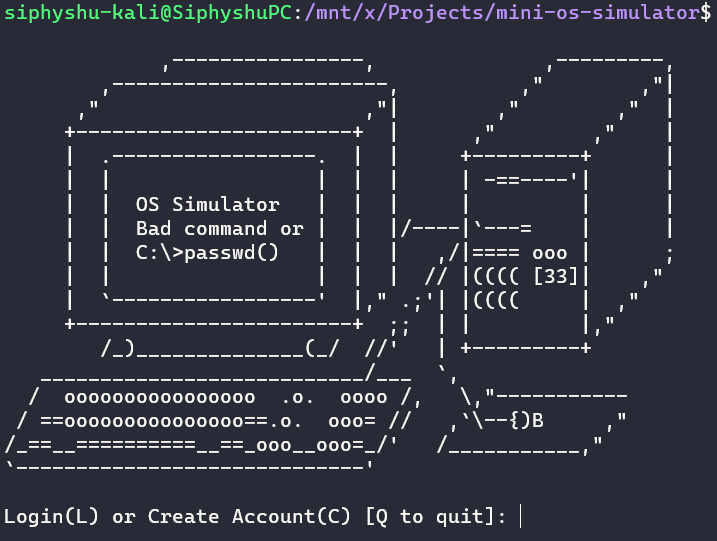

# Mini OS Simulator

### Summary

🎈 A Mini CLI-based Operating System simulator, well, not really. 
It simulates a file system with songs and movies and stuff.
A full account authorization login mechanism and a touch of personalization even. 
Got a lot of fun games aswell, but that's just about it.
I made this just because I wanted to write a lot of code and spend my night doing so.

It has got some simple features such as:
- A personal notepad 📒
- Lots of games 🎮
- Movies and songs 📺
- Personal account system 🧑

### Usage

Run the python file in any terminal using: `python ./main.py`  
Then, start by creating an account if you don't have one.

Follow the steps it asks, then after account creating, login!
